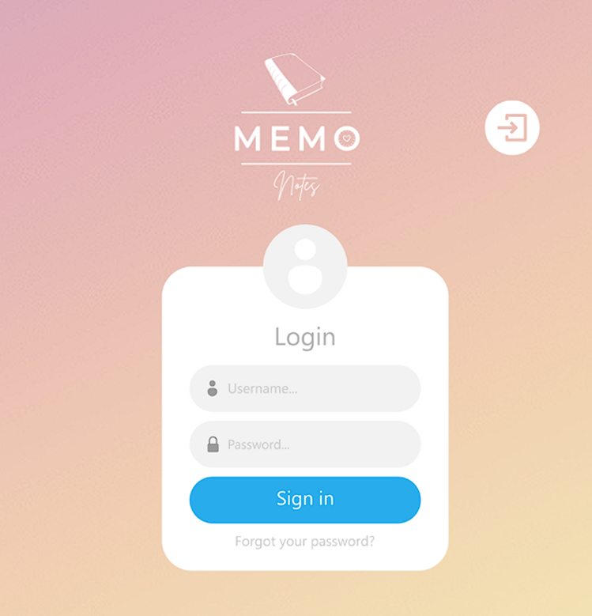

# Proyecto Desarrollo y Arquitecturas Web
#### Integrantes: `Juan Rios y Melina Tabor`

## Sistema para Cuadernos Inteligentes
__Memo Notes__ es un negocio relacionado con la producción de cuadernos inteligentes.
El propósito fundamental del sistema propuesto para es optimizar y unificar las operaciones clave de la empresa relacionadas con la producción de cuadernos inteligentes y la gestión de ventas en tienda. 

A través de una plataforma tecnológica eficiente y cohesionada, el sistema busca potenciar la planificación de producción y la interacción con los clientes en la tienda física.

En la tienda física de Memo Notes, se ejecuta un proceso de ventas diseñado para brindar a los clientes una experiencia fluida y satisfactoria al adquirir cuadernos. 
Se realiza un proceso de ventas que abarca diversas etapas, abordando desde la interacción inicial con el cliente hasta la conclusión exitosa de la compra. El flujo operativo se enfoca en el registro preciso del cliente, la confirmación de la disponibilidad de los productos deseados, la concreción de la venta mediante el cobro y la entrega final de los productos seleccionados.

Con el objetivo de optimizar y unificar este proceso, el sistema busca incorporar una funcionalidad de software que facilite la ejecución eficiente de todas estas actividades. 

El negocio pretende reducir la sobrecarga de recursos y minimizar el desperdicio de materiales al traducir las especificaciones de producción en cantidades exactas de recursos. Esto no solo optimizará la utilización de recursos, sino que también permitirá cumplir con las demandas de los clientes de manera efectiva.

Además, el sistema tiene como objetivo elevar la experiencia de los clientes en las tiendas físicas al proporcionar a los vendedores las herramientas necesarias para ofrecer asesoramiento basado en datos en tiempo real. La disponibilidad instantánea de información sobre productos y alternativas permitirá a los vendedores brindar un servicio personalizado y efectivo, aumentando la satisfacción del cliente y, en última instancia, fomentando la lealtad a la marca.

